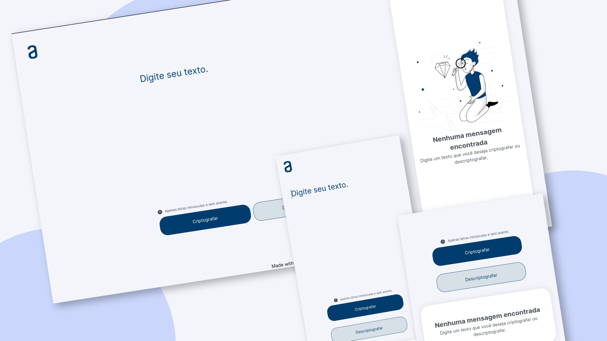

# Projeto Codificador

## Description

Esse projeto faz parte do desafio do [Challenge ONE - Iniciante em Programação da Alura](https://www.alura.com.br/challenges/challenge-one-logica).
A proposta é criar um simples código que codifique e decodifique uma mensagem.

## Preview

    
   

## Live Demo

[Live Demo Link](https://mrescappe.github.io/Decodificador-de-Texto-Alura/)

## Funcionalidades

- O usuário tem a opção de codificar ou decodificar uma mensagem.
- O Projeto funciona na versão desktop e mobile.

## Built with

- 
- 
- 

## O que eu aprendi

- Aprendi mais sobre como utilizar a manipulação de elementos do DOM.
- E trabalhar mais a logica de programação, e entender como funciona a codificação e decodificação de mensagens.

## Licensa de uso

- MIT. See [LICENSE](/LICENSE) for more details.
- Copyrigth (c) 2024 [José Sérgio](https://github.com/MrEscappe)
